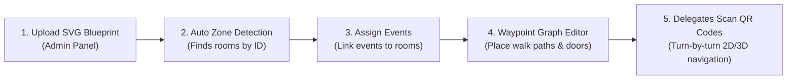
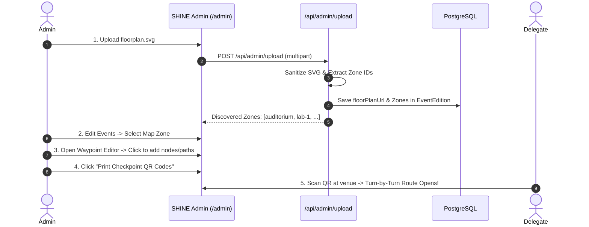

# SHINE Indoor Venue Floor Plan & Wayfinding Guide

Welcome to the **SHINE 26 Floor Plan & Wayfinding Guide**. This comprehensive guide is designed for **both beginners** (event coordinators, student organizers, and non-technical staff) and **developers/designers** who want to create, customize, and manage indoor venue blueprints and shortest-path navigation graphs.

---

## Table of Contents
1. [Overview: How the Floor Plan Works in SHINE](#1-overview-how-the-floor-plan-works-in-shine)
2. [Beginner's Guide: 4 Ways to Create a Floor Plan (No Coding Required)](#2-beginners-guide-4-ways-to-create-a-floor-plan-no-coding-required)
   - [Method 1: AI Prompt Generation (Fastest — 2 Minutes)](#method-1-ai-prompt-generation-fastest--2-minutes)
   - [Method 2: Draw.io / Diagrams.net (Visual Drag-and-Drop)](#method-2-drawio--diagramsnet-visual-drag-and-drop)
   - [Method 3: Figma or Inkscape (Vector Tracing from Blueprint)](#method-3-figma-or-inkscape-vector-tracing-from-blueprint)
   - [Method 4: Customizing Pre-built Sample Templates](#method-4-customizing-pre-built-sample-templates)
3. [The Golden Rules for Floor Plan SVGs](#3-the-golden-rules-for-floor-plan-svgs)
4. [Step-by-Step Admin Setup Workflow](#4-step-by-step-admin-setup-workflow)
5. [Technical Architecture & SVG Layer Specification](#5-technical-architecture--svg-layer-specification)
6. [Element ID Conventions & Zone Extraction](#6-element-id-conventions--zone-extraction)
7. [Wayfinding Graph Data Model (`waypointGraph`)](#7-wayfinding-graph-data-model-waypointgraph)
8. [Shortest-Path Navigation Engine (A*)](#8-shortest-path-navigation-engine-a)
9. [Security & SVG Sanitization](#9-security--svg-sanitization)
10. [Troubleshooting & Frequently Asked Questions](#10-troubleshooting--frequently-asked-questions)

---

## 1. Overview: How the Floor Plan Works in SHINE

The SHINE indoor mapping system turns a standard 2D vector file (`.svg`) into a smart, interactive campus map:



- **Interactive 2D Blueprint**: Students and delegates can zoom, pan, click rooms to see ongoing events, and filter amenities (restrooms, water stations, food courts, help desks).
- **Interactive 3D Simulation**: Real-time Three.js extrusion converting 2D rooms into volumetric 3D buildings.
- **Shortest-Path Wayfinding**: Scanned QR checkpoints (e.g. `Main Entrance Gate`) calculate optimal walking routes and step-by-step directions to competition halls.

---

## 2. Beginner's Guide: 4 Ways to Create a Floor Plan (No Coding Required)

You do **not** need to be a software developer or graphic designer to create a floor plan. Pick the method that feels easiest for you:

### Method 1: AI Prompt Generation (Fastest — 2 Minutes)
Use ChatGPT, Claude, Gemini, or an AI coding assistant. Simply describe your college building in plain language.

#### Copy-Paste Prompt Template:
```text
I need an indoor floor plan SVG for my college event portal.
The canvas should be viewBox="0 0 1000 800" with a dark midnight theme (background: #0B0A0A).

Please include the following rooms as closed <rect> or <polygon> shapes with distinct dark accent fills and glowing borders:
- Main Entrance at the bottom center
- Main Auditorium at top center (id="auditorium", fill="#134e4a", stroke="#2dd4bf")
- Computer Lab 1 on left side (id="lab-1", fill="#0c4a6e", stroke="#38bdf8")
- Seminar Hall on right side (id="seminar-hall", fill="#713f12", stroke="#facc15")
- Food Court near bottom right (id="food-court", fill="#701a75", stroke="#f472b6")
- Restroom amenity icon (id="amenity-restroom-1")
- Drinking Water amenity icon (id="amenity-water-1")

Requirements:
1. Every room must have its id directly on the shape element.
2. Put readable white labels centered in each room.
3. Keep the corridors dark (#1e293b) with dashed walking guide lines.
4. Output valid, raw SVG code only.
```

Save the output as `my-floorplan.svg` and upload it directly into the SHINE Admin Panel.

---

### Method 2: Draw.io / Diagrams.net (Visual Drag-and-Drop)
[Draw.io](https://app.diagrams.net) is a completely free, browser-based diagramming tool that runs without requiring an account.

1. **Start a Blank Canvas**:
   - Go to [draw.io](https://app.diagrams.net) &rarr; select **Create New Diagram** &rarr; **Blank Diagram**.
2. **Draw Rooms**:
   - Drag **Rectangle** shapes from the left panel onto the canvas for each room (Auditorium, Labs, Seminar Halls).
   - Double-click each rectangle to type its display name (e.g. `MAIN AUDITORIUM`).
   - Change colors in the right panel (pick dark fills like dark blue, dark teal, or slate gray with bright border outlines).
3. **Assign the Room ID (Crucial)**:
   - Click a room shape.
   - Press `Ctrl + M` (or right-click &rarr; **Edit Data...**).
   - Set the `ID` property to a clean lowercase identifier (e.g. `auditorium`, `hall-1`, `lab-2`, `food-area`).
4. **Export as SVG**:
   - Go to **File** &rarr; **Export as** &rarr; **SVG...**
   - In the export dialog:
     - Uncheck *"Include a copy of my diagram"* (keeps the file clean).
     - Click **Export** &rarr; save as `campus-floorplan.svg`.

---

### Method 3: Figma or Inkscape (Vector Tracing from Blueprint)
If you have a photo, architectural blueprint, or aerial view of your campus:

1. **Setup Frame / Canvas**:
   - Create a frame with dimensions **1000 × 800 px** (or 1200 × 900 px).
   - Set background fill to `#0B0A0A`.
2. **Trace Over Blueprint**:
   - Import your photo or blueprint image and set its layer opacity to 30% (lock this layer).
   - Use the **Rectangle tool (R)** or **Pen tool (P)** to trace corridors, walls, and rooms over the image.
   - Ensure every room is a **closed path or rectangle**.
3. **Name Your Layers (Figma/Inkscape Layer Name = SVG ID)**:
   - Rename each room layer in the left layers panel to its desired ID:
     - `auditorium`
     - `hall-1`
     - `lab-ai`
     - `seminar-hall`
     - `amenity-restroom-1`
     - `amenity-water-1`
4. **Export Settings**:
   - In Figma: Click Frame &rarr; Export &rarr; Select **SVG** &rarr; Click `...` options &rarr; **Check "Include id attribute"**.
   - In Inkscape: *File &rarr; Save As... &rarr; Plain SVG*.

---

### Method 4: Customizing Pre-built Sample Templates
Your project already includes two complete, professionally styled floor plans:
- `public/samples/academic-block-floorplan.svg` (College quadrangle with labs, seminar halls, and auditorium)
- `public/samples/tech-convention-floorplan.svg` (Convention arena with booths, expo stage, and catering)

#### How to customize:
1. Open [`public/samples/academic-block-floorplan.svg`](file:///home/sakthi-t4gc/Sakthi%20T4GC/shc-shine/public/samples/academic-block-floorplan.svg) in any text editor (Notepad, VS Code).
2. Search for the text elements (e.g. `MAIN AUDITORIUM`, `PG AI LAB`, `SEMINAR HALL A`).
3. Replace them with your college’s actual room names (e.g. `KAVARASSERY HALL`, `DATA SCIENCE LAB`).
4. Save the file and upload it in the Admin panel!

---

## 3. The Golden Rules for Floor Plan SVGs

| Rule | Requirement | Why it Matters |
| :--- | :--- | :--- |
| **1. Standard Canvas** | `viewBox="0 0 1000 800"` | Ensures responsive scaling on mobile phones, tablets, laptops, and projectors without distorting coordinates. |
| **2. Unique Room IDs** | `<rect id="hall-1" ...>` | SHINE automatically detects room shapes by their `id`. Events are assigned to these IDs. |
| **3. Closed Shapes** | Must be `<rect>`, `<polygon>`, or closed `<path>` (ends with `Z`) | Open lines cannot be filled with color when hovered, selected, or extruded in 3D. |
| **4. Amenities Prefix** | `id="amenity-restroom-1"`, `id="amenity-water-1"`, etc. | Allows delegates to toggle amenities on/off using the map legend. |
| **5. Dark Background** | `#0B0A0A` or `#0F172A` | Integrates seamlessly with SHINE 26’s midnight aesthetic and neon accent styling. |

> [!CAUTION]
> **Do not put the `id` on the `<text>` element!**
> The `id` must be on the room shape itself (`<rect>`, `<polygon>`, `<path>`). Text elements are visual overlays only.

---

## 4. Step-by-Step Admin Setup Workflow

Once your SVG file is ready:



1. **Upload Blueprint**:
   - Navigate to `/admin` &rarr; scroll to **Venue Floor Plan & Wayfinding**.
   - Drag and drop your `.svg` file.
   - The system automatically sanitizes the file and extracts all valid room zones.
2. **Assign Events to Rooms**:
   - Go to **Admin &rarr; Events**.
   - When creating or editing an event, choose the detected room in the **Map Zone / Room** dropdown.
3. **Configure Navigation Graph**:
   - In the **Interactive Waypoint Editor**, click anywhere on corridors to place walking nodes.
   - Connect entrance doors (`wp-auditorium`, `wp-lab-1`) to corridor junctions.
   - Mark staircase nodes if your venue spans multiple floors.
4. **Generate Physical QR Checkpoints**:
   - Click **Print Checkpoint QRs** in the Admin panel.
   - Batch-print QR codes for physical posts around campus (e.g. `Main Entrance Gate`, `Food Court Entrance`, `Stairs Lobby`).
   - Delegates scan these with any smartphone camera to open directions directly to their next competition.

---

## 5. Technical Architecture & SVG Layer Specification

Every indoor floor plan uploaded to SHINE must be a valid, sanitized SVG file adhering to the following layer structure:

```xml
<svg xmlns="http://www.w3.org/2000/svg" viewBox="0 0 1000 800" width="100%" height="100%">
  <defs>
    <!-- Background grid patterns, gradients, and glow filters -->
  </defs>

  <!-- Layer 1: Campus Blueprint Background & Walls -->
  <rect width="100%" height="100%" fill="#0B0A0A" />

  <!-- Layer 2: Rooms & Competition Arenas -->
  <!-- Every room MUST be a closed filled shape (path, polygon, rect) with its ID ON the shape -->
  <g id="rooms">
    <path id="hall-1" d="..." fill="#141923" stroke="#22d3ee" stroke-width="2" />
    <polygon id="hall-2" points="..." fill="#141923" stroke="#38bdf8" />
    <rect id="hall-3" x="690" y="510" width="130" height="90" rx="10" />
    <polygon id="food-area" points="..." />
  </g>

  <!-- Layer 3: Room Labels (Visual text overlays) -->
  <g id="labels" pointer-events="none">
    <text x="420" y="320" fill="#ffffff" font-size="14" font-weight="bold">Hall 1</text>
  </g>

  <!-- Layer 4: Amenities Layer (<g id="amenities">) -->
  <g id="amenities">
    <g id="amenity-restroom-1">...</g>
    <g id="amenity-water-1">...</g>
    <g id="amenity-food-1">...</g>
    <g id="amenity-helpdesk-1">...</g>
  </g>

  <!-- Layer 5: Waypoints Layer (<g id="waypoints">) -->
  <!-- Navigation graph nodes for doors, junctions, stairs, and checkpoints -->
  <g id="waypoints" opacity="0.9">
    <circle id="wp-entrance" cx="410" cy="635" r="5" fill="#f43f5e" />
    <circle id="wp-central-hub" cx="420" cy="500" r="5" fill="#38bdf8" />
    <circle id="wp-hall-1" cx="425" cy="460" r="5" fill="#34d399" />
    <circle id="wp-stairs-west" cx="330" cy="520" r="5" fill="#c084fc" data-floor="1" />
  </g>
</svg>
```

---

## 6. Element ID Conventions & Zone Extraction

### A. Rooms & Venue Zones (Competition Arenas)
- Must be a closed shape (`<path>`, `<polygon>`, `<rect>`).
- The `id` attribute is placed directly on the shape element.
- Do NOT prefix competition rooms with `wp-` or `amenity-`.
- Valid examples:
  - `hall-1` (Main Auditorium Stage)
  - `hall-2` (Octagon Coding Arena)
  - `hall-3` (PG Computer Lab 1)
  - `food-area` (Central Food Court)
  - `sponsor-booths` (Expo & Career Stalls)
  - `registration-entrance` (Main Delegate Lobby)

### B. Amenities Layer (`<g id="amenities">`)
- Grouped inside `<g id="amenities">`.
- Uses standardized prefix format:
  - Restrooms: `amenity-restroom-1`, `amenity-restroom-2`, ...
  - Drinking Water: `amenity-water-1`, `amenity-water-2`, ...
  - Food & Refreshments: `amenity-food-1`, `amenity-food-2`, ...
  - Help Desk & Security: `amenity-helpdesk-1`, `amenity-helpdesk-2`, ...
- The 2D map interactive legend automatically recognizes these IDs for dynamic category filtering.

### C. Navigation Waypoints (`<g id="waypoints">`)
- Grouped inside `<g id="waypoints">` or configured via the visual admin editor.
- Drawn as SVG `<circle>` elements with coordinates `cx`, `cy`, and `r="5"`.
- Must begin with `wp-`.
- Types of waypoints:
  1. **Entrance / Checkpoint**: `wp-entrance`
  2. **Hall / Room Doors**: `wp-<zoneId>` (e.g. `wp-hall-1` corresponds to door entrance of `hall-1`). This allows the A* engine to automatically route from any checkpoint directly to the room door.
  3. **Corridor Junctions**: `wp-central-hub`, `wp-west-junction`, `wp-east-hub`
  4. **Vertical Transit (Stairs / Elevators)**: `wp-stairs-west`, `wp-stairs-east`, `wp-lift-main`
     - Include optional `data-floor="1"` attribute (defaults to 1 if omitted).

---

## 7. Wayfinding Graph Data Model (`waypointGraph`)

Stored inside the PostgreSQL `event_editions` table as a JSON object:

```json
{
  "nodes": [
    { "id": "wp-entrance", "x": 410, "y": 635, "floor": 1, "label": "Main Entrance Gate" },
    { "id": "wp-central-hub", "x": 420, "y": 500, "floor": 1, "label": "Central Quadrangle Hub" },
    { "id": "wp-hall-1", "x": 425, "y": 460, "floor": 1, "label": "Hall 1 Entrance", "zoneId": "hall-1" },
    { "id": "wp-stairs-west", "x": 330, "y": 520, "floor": 1, "label": "West Staircase (Ground Floor)" },
    { "id": "wp-stairs-west-f2", "x": 330, "y": 520, "floor": 2, "label": "West Staircase (Floor 2)" }
  ],
  "edges": [
    { "a": "wp-entrance", "b": "wp-central-hub", "weight": 135.37 },
    { "a": "wp-central-hub", "b": "wp-hall-1", "weight": 40.31 },
    { "a": "wp-stairs-west", "b": "wp-stairs-west-f2", "weight": 250.0, "isStairOrLift": true }
  ]
}
```

### Edge Weights
- **Horizontal (same floor)**: Calculated as Euclidean distance:
  $$\text{weight} = \sqrt{(x_2 - x_1)^2 + (y_2 - y_1)^2}$$
- **Vertical (stairs / lift between floors)**: Configured with a floor transition penalty (default `250.0` units) to prioritize same-floor routing unless changing floors is strictly necessary.

---

## 8. Shortest-Path Navigation Engine (A*)

The wayfinding engine in `src/lib/wayfinding.ts` provides:

```typescript
shortestPath(
  graph: WaypointGraph,
  fromWaypointId: string, // e.g. "wp-entrance" or scanned QR checkpoint
  toTarget: string        // zoneId ("hall-1") or waypointId ("wp-hall-1")
): PathResult
```

### Algorithm Highlights:
1. **Target Resolution**: If `toTarget` is a room `zoneId`, the engine automatically maps it to the closest entrance waypoint (e.g. `wp-hall-1` or node with `zoneId === "hall-1"`).
2. **Heuristic $h(n)$**: Admissible Euclidean distance to target in 2D/3D space ensures the A* search is optimal.
3. **Turn-by-Turn Steps**: The algorithm computes heading vectors and generates natural human instructions:
   - *"Start at Main Entrance Gate"*
   - *"Walk straight along the central corridor towards Central Quadrangle Hub"*
   - *"Take West Staircase up to Floor 2"*
   - *"Turn left and arrive at Hall 1 Main Auditorium"*

---

## 9. Security & SVG Sanitization

When an SVG is uploaded by an administrator at `POST /api/admin/upload`:
1. All `<script>` and `<iframe>` elements are removed.
2. All `on*` event handlers (`onclick`, `onload`, `onerror`, etc.) are stripped.
3. `<foreignObject>` containers are eliminated.
4. External URL references (`href="http://..."`, CSS `url(...)`) are sanitized to prevent SSRF and external asset tracking.
5. Max file size: 2 MB.

---

## 10. Troubleshooting & Frequently Asked Questions

### Q: I uploaded my SVG, but my rooms don't appear in the "Discovered Rooms" list!
**A:** Check your SVG file. Did you put the `id` on the `<text>` element instead of the `<rect>` or `<path>`? The room shape itself must have `id="room-name"`. Ensure the shape is a closed polygon, rectangle, or closed path.

### Q: Why do my colors look washed out or bright white?
**A:** Ensure your SVG has dark fills (e.g. `#111827`, `#0c4a6e`, `#1e3a34`) and bright borders (`#38bdf8`, `#34d399`). Also ensure a dark background rectangle (`<rect width="100%" height="100%" fill="#0B0A0A" />`) is present.

### Q: How do physical QR codes work when delegates scan them?
**A:** Each QR code encodes a URL like `https://fest.yourschool.edu/loc/wp-entrance`. When delegates scan it, the page saves `wp-entrance` as their current position in browser `localStorage` and immediately displays the floor plan with directions to their next registered event. No login or app installation is required!

### Q: Can I update the floor plan on the day of the fest without breaking existing QR codes?
**A:** **Yes!** As long as your waypoint IDs (`wp-entrance`, `wp-central-hub`) remain the same, you can update the background blueprint SVG or adjust edges at any time without reprinting physical QR codes.
